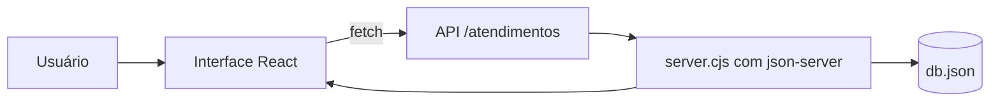

# Gerenciador de Atendimentos

## Visão geral

O projeto é um sistema web para controle de atendimentos/suporte técnico, construído com React e Vite, usando `json-server` como banco local baseado em `db.json`.

A proposta foi manter a aplicação simples de manter, visualmente mais moderna e totalmente baseada em um arquivo JSON editável, o que facilita demonstrações, protótipos e apresentações em sala.

## Objetivo do sistema

O sistema organiza chamados de clientes, permitindo:

- cadastrar novos atendimentos;
- editar chamados existentes;
- alternar status entre aberto, em andamento e resolvido;
- buscar e filtrar registros;
- visualizar métricas e gráficos do painel;
- exportar e importar backup em JSON e CSV.

## Arquitetura

### Visão em alto nível



### Camadas do projeto

#### Frontend

Responsável pela interface, estado da aplicação e interação com a API.

Arquivos principais:

- [src/App.jsx](src/App.jsx)
- [src/components/AtendimentoModal.jsx](src/components/AtendimentoModal.jsx)
- [src/components/PainelTopo.jsx](src/components/PainelTopo.jsx)
- [src/components/PainelAnalitico.jsx](src/components/PainelAnalitico.jsx)
- [src/components/PainelFiltros.jsx](src/components/PainelFiltros.jsx)
- [src/components/ListaAtendimentos.jsx](src/components/ListaAtendimentos.jsx)
- [src/lib/atendimentos.js](src/lib/atendimentos.js)

#### Backend local

O backend é um servidor simples baseado em `json-server`, que expõe a coleção `atendimentos` como uma API REST.

Arquivo principal:

- [server.cjs](server.cjs)

#### Persistência

Os dados ficam no arquivo [db.json](db.json). Esse modelo é ideal para protótipo e apresentação, mas não foi pensado para persistência robusta em produção.

## Tecnologias utilizadas

- React 19
- Vite
- JavaScript moderno
- Tailwind CSS
- json-server
- Node.js

## Estrutura de dados

Cada atendimento possui campos como:

- `id`
- `cliente`
- `whatsapp`
- `problema`
- `status`
- `prioridade`
- `categoria`
- `responsavel`
- `observacoes`
- `criadoEm`
- `atualizadoEm`
- `resolvidoEm`
- `historico`

### Exemplo de registro

```json
{
  "id": "TYT3oE6",
  "cliente": "teste",
  "whatsapp": "(11) 11111-1111",
  "problema": "adwadw",
  "status": "Aberto",
  "prioridade": "Média",
  "categoria": "Geral",
  "responsavel": "",
  "observacoes": "",
  "criadoEm": "2026-05-29T00:00:00.000Z",
  "atualizadoEm": "2026-05-29T00:00:00.000Z",
  "resolvidoEm": null,
  "historico": []
}
```

## Funcionalidades da interface

### 1. Painel principal

A primeira área da tela apresenta a identidade do sistema e reúne botões de ação rápida:

- abrir novo atendimento;
- exportar backup JSON;
- exportar CSV;
- importar backup.

Também exibe indicadores principais, como total de chamados, abertos, em andamento, resolvidos, urgentes e vencidos.

### 2. Gráficos e métricas

O painel analítico mostra:

- distribuição por status em formato de donut;
- categorias mais frequentes;
- clientes com mais ocorrências;
- tendência de chamados criados nos últimos 7 dias.

### 3. Filtros e busca

A tela permite:

- buscar por cliente, WhatsApp, problema, responsável ou categoria;
- filtrar por status;
- filtrar por prioridade;
- filtrar por categoria;
- ordenar por mais recentes, mais antigos, prioridade ou status.

### 4. Lista de atendimentos

Cada card da lista mostra:

- cliente;
- status;
- prioridade;
- categoria;
- WhatsApp;
- problema;
- responsável;
- histórico resumido;
- observações.

O usuário pode:

- resolver ou reabrir o chamado;
- editar o atendimento;
- excluir o registro.

### 5. Modal de cadastro e edição

O modal é reutilizado para criar e editar chamados, reduzindo duplicação de interface.

Campos disponíveis:

- cliente;
- WhatsApp;
- problema;
- status;
- prioridade;
- categoria;
- responsável;
- observações.

## Fluxo de dados

### Criação

1. O usuário preenche o modal.
2. A interface valida campos obrigatórios.
3. O frontend envia `POST` para `/atendimentos`.
4. O `json-server` grava no `db.json`.
5. A lista é recarregada.

### Edição

1. O usuário abre o modal em modo de edição.
2. Os dados atuais são carregados no formulário.
3. O sistema registra alterações no histórico.
4. O frontend envia `PUT` para `/atendimentos/:id`.
5. A lista é atualizada.

### Exclusão

1. O usuário confirma a exclusão.
2. O frontend envia `DELETE` para `/atendimentos/:id`.
3. O registro é removido do `db.json`.

## Scripts do projeto

### Desenvolvimento

```bash
npm run dev
```

Esse comando sobe:

- o `json-server` via `server.cjs`;
- o Vite para o frontend.

### Build de produção

```bash
npm run build
```

Gera a versão otimizada da aplicação em `dist/`.

### Validação

```bash
npm run lint
```

### Execução da aplicação em produção local

```bash
npm start
```

## Hospedagem no Render

O projeto foi pensado para rodar no Render com a sequência:

1. `npm run build`
2. `npm start`

### O que acontece no deploy

- o Vite gera os arquivos estáticos dentro de `dist/`;
- o `server.cjs` sobe o servidor Node;
- o `json-server` expõe os endpoints REST;
- o `server.cjs` também entrega a aplicação estática.

### Observação importante

Como a persistência depende de `db.json`, o banco pode ser reiniciado após períodos de inatividade, dependendo da configuração do ambiente hospedado. Para esta apresentação, isso é aceitável porque o foco é demonstração funcional.

## Decisões de projeto

### Por que usar JSON como banco

- simplicidade;
- baixa complexidade de implementação;
- fácil entendimento para apresentação;
- rápido para prototipação;
- mantém o projeto totalmente legível.

### Por que separar em componentes

- facilita manutenção;
- melhora leitura do código;
- reduz o tamanho do `App.jsx`;
- permite evolução modular da interface.

### Por que usar gráficos em SVG puro

- evita dependências extras;
- reduz peso do projeto;
- suficiente para um painel visual claro;
- funciona bem para apresentação.

## Pontos fortes da solução

- interface moderna e responsiva;
- foco em leitura rápida dos atendimentos;
- métricas úteis para tomada de decisão;
- backup e importação facilitam demonstração;
- estrutura simples de explicar em apresentação oral.

## Limitações conhecidas

- persistência em produção não é robusta como um banco relacional ou cloud;
- os dados podem ser reiniciados dependendo do ambiente;
- o modelo é ideal para protótipo, aula e demonstração, não para carga real de produção.

## Roteiro sugerido para apresentação

### Slide 1 - Título

Nome do projeto, objetivo e autoria.

### Slide 2 - Problema

Explicar a necessidade de centralizar atendimentos e acompanhar status.

### Slide 3 - Solução proposta

Mostrar que a aplicação organiza chamados em um painel único.

### Slide 4 - Arquitetura

Apresentar o fluxo React -> API -> db.json.

### Slide 5 - Tecnologias

Listar React, Vite, Tailwind, json-server e Render.

### Slide 6 - Funcionalidades principais

Cadastro, edição, filtros, gráficos e exportação.

### Slide 7 - Hospedagem

Explicar o deploy no Render com build e start.

### Slide 8 - Limitações e próximos passos

Comentar a limitação do JSON e possíveis evoluções futuras.

## Próximos passos possíveis

- exportar este conteúdo para um template de slides;
- reduzir o texto para uma versão mais curta e direta;
- transformar o conteúdo em tópicos prontos para PowerPoint;
- criar um roteiro de fala para apresentação em sala.
